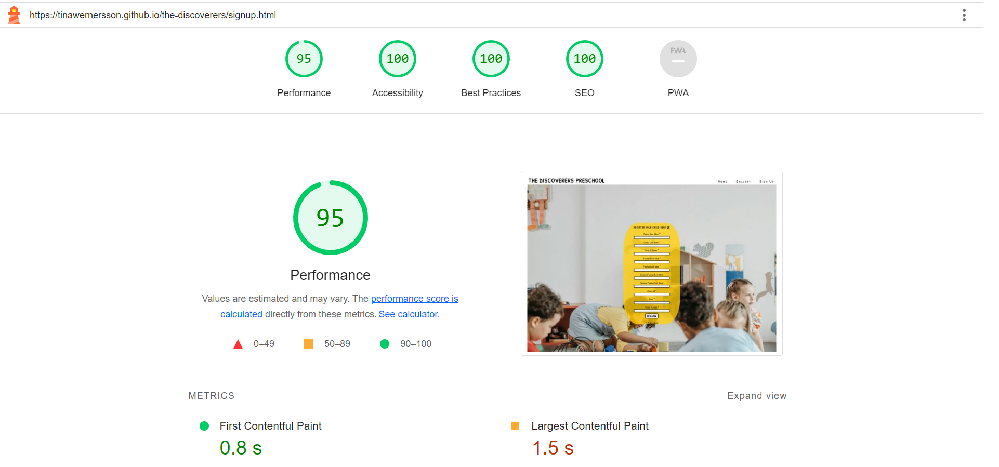
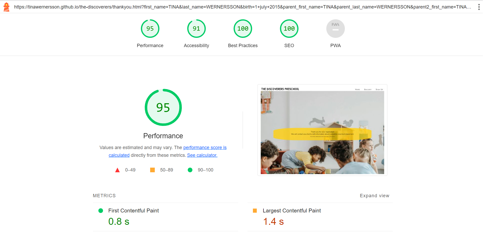

# The Discoverers Preschool

[Link to live site!](https://tinawernersson.github.io/the-discoverers/)

## This is The Discoverers Preschool

The Discoverers Preschool want to educate small children into good and independent citizens by taking care of their own interests and abilities. The preschool teachers can then make the education more idividual-based so every child can participate on their own terms. The name "Discoverers" is a way of think of children as discoverers. Adults can learn very much about the children and of a specific subject if they work together and discover things together! All children are welcome to The Discoverers Preschool.

The site
- have a preschool spirit with playful fonts and colors
- have a simple navigation design to make it easy for users to navigate on the page

Register your child in the sign up form!

## UX

The idea of the webpage is to attract parents to register their child for this preschool.

### User Stories

* First-time visitor goals

  * Get an understanding of the main idea of the site and learn more about The Discoverers Preschool.
  * Easily and effective navigate on the site.
  * Find the sign up form and register their child.

 * Returning visitor goals

   * Find contact and location information.
   * Have a look at the site's colorful gallery.

   ## Typography

For The Discoverers Preschool I used Google Fonts as it is easy to use, accessible and make the design of the page more appealing.

Here are the links to the fonts and icons I've used in my project:

- [Patrick Hand SC](https://fonts.google.com/specimen/Patrick+Hand+SC) was used for all primary texts such as header, headings and in the sign up form.

- [Nunito](https://fonts.google.com/specimen/Nunito) was used for all other secondary text.

- [Font Awesome](https://fontawesome.com) icons were used on the home page and sign up form, such as the social media icons in the footer (on all pages).

## Features

This website's targeting group is parents of small children who is looking for a placement at a preschool.
The parents can register their child by navigating to the sign-up page and fill out the form.
The website is responsive and can be used on devices such as laptops, mobile devices and tablets.

### Existing features

- Navigation bar
  - It is featured on all three pages and the thankyou page.
  - Includes links to the logo, home page, gallery, and sign-up page.
  - It is identical in design across the pages.
  - When the user hover over the navbar the links turn red.
  - The user will never have to use the "back" navigation button in the web browser thanks to the easy navigation from one page to another on the website.

  
  

- Main heading

  - In the home page there is a hero section with a picture of childrens hands in a circle with a heading that says "The Discoverers Preschool".
  - The Gallery page has a hidden heading that says "Gallery".
  - In the sign up page the heading is in the form that says "Register your child here!"

  

  

- First section, Information about the preschool

  - The green box contains attractive and useful information about The Discoverers Preschool and a link to the sign up page.
  - The second box is a picture of the staff wich represent the preschool.

  

- Second section, after school activites
  
  - In this section are two different after school activities offered, a craft session and a play session.
  - The yellow box contains a short introduction on what the activities offers.
  - The blue boxes contains information on place, day and time when each activity is offered.

  

- Third section, contact

  - This section contains contact and location information

- Footer, Social media

  - Holds information to The Discoverers social media platforms, all opens in new tabs for a better user experience.
  - Facilitates for the users and gives them an additional contact channel.

  

- Gallery
  
  - Provides users with pictures from the preschool to make it look more appealing and interesting.
  - The users get the possibility to se the preschool from the inside and se what they offering the children.

  

- Sign up page

  - Holds a form where the user can register their interest for having their child in The Discoverers preschool. 
  - All fields are mandatory except for "second parents name", and that is because if it's only one parent to the child.

  

- Thank you page

  - When the user's filled the form they will be redirected to a page that says "Thank you for your registration!.."
  - The page will automatically go back to the home page after 20 seconds if the user don't do anything. For better user experience I have added a paragraph that informs the user about this redirection.

  

### Features Left to Implement

- A contact link in the home page for teachers who's searching for a job.

In the future, there could be a link to a platform for parents who already have their children in this preschool. It can contain registration of childrens length of stay, general information from the preschool to the parents and individual educational progression plan for the children.

## Technologies Used

 * [HTML5](https://en.wikipedia.org/wiki/HTML5)
 * [CSS3](https://en.wikipedia.org/wiki/CSS)

## Frameworks, Libraries & Programs Used

 * [Gitpod](https://www.gitpod.io/)
    * To write the code.
 * [Github](https://github.com/)
    * Deployment of the website and storing the files online.
* [Git](https://git-scm.com/)
    * For version control
 * [Google Fonts](https://fonts.google.com/)
    * Import main font the website.
* [Am I Responsive](https://ui.dev/amiresponsive)
    * Mockup picture for the README file.

    ## Testing

The W3C Markup Validator and W3C CSS Validator services were used to validate every page of the project to ensure there were no errors.

 * [W3C Markup Validator](https://validator.w3.org/)
 * [W3C CSS Validator](https://jigsaw.w3.org/css-validator/)

 ### Validation results

Homepage
 
 Gallery page
 
 Sign up page
 
 Thank you page
 

CSS-file
 

### Manual Testing

The website was tested on Google Chrome, Microsoft Edge, and Safari browsers.
The website was viewed on a laptop, Ipad tablet and Samsung Galaxy S21 mobile phone.
Testing was done to ensure links between pages are working correctly on all pages.
Dev Tools was used to test how the site looks on various screen sizes.

## Lighthouse report

### Mobile screeen

Home page

Gallery Page

Sign up page

Thank you page

### Desktop

Home page

Gallery page

Sign up page

Thank you page

### Bug fixes
The reason the website get low performance score in Lighthouse is probably because of the high resoluted pictures, the files is too big and needs to be downsized.

## Deployment and local development

### GitHub Pages

GitHub Pages used to deploy live version of the website.
1. Log in to GitHub and locate [GitHub Repository the-discoverers](https://github.com/tinawernersson/the-discoverers)
2. At the top of the Repository(not the main navigation) locate "Settings" button on the menu.
3. Scroll down the Settings page until you locate "GitHub Pages".
4. Under "Source", click the dropdown menu "None" and select "Main" and click "Save".
5. The page will automatically refresh.
6. Scroll back to locate the now-published site [link](https://tinawernersson.github.io/the-discoverers/) in the "GitHub Pages" section.

### Forking the GitHub Repository

By forking the repository, we make a copy of the original repository on our GitHub account to view and change without affecting the original repository by using these steps:

1. Log in to GitHub and locate [GitHub Repository the-discoverers](https://github.com/tinawernersson/the-discoverers)
2. At the top of the Repository(under the main navigation) locate "Fork" button.
3. Now you should have a copy of the original repository in your GitHub account.

### Local Clone

1. Log in to GitHub and locate [GitHub Repository the-discoverers](https://github.com/tinawernersson/the-discoverers)
2. Under the repository name click "Clone or download"
3. Click on the code button, select clone with HTTPS, SSH or GitHub CLI and copy the link shown.
4. Open Git Bash
5. Change the current working directory to the location where you want the cloned directory to be made.
6. Type `git clone` and then paste The URL copied in the step 3.
7. Press Enter and your local clone will be created.

---

## Credits

### Code
 * Understanding the concept of flexbox was learned through [Complete Guide to Flexbox](https://css-tricks.com/snippets/css/a-guide-to-flexbox/)
 * The README template was helpfully provided by [Code Institute (template)](https://github.com/Code-Institute-Solutions/SampleREADME)

### Content

 * All content was written by the developer.

### Media 

 * [Pexels](https://www.pexels.com/) free stock photos, royalty free images.